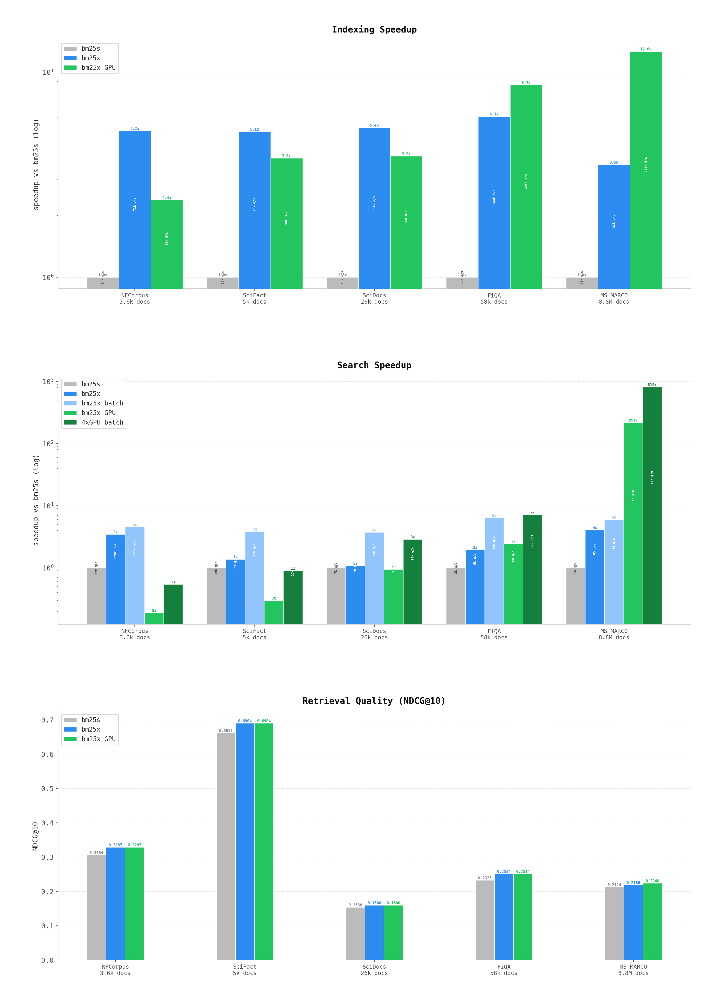

<p align="center">
  
</p>

<p align="center">
  <a href="https://crates.io/crates/bm25x"></a>
  <a href="https://pypi.org/project/bm25x/"></a>
  <a href="https://github.com/lightonai/bm25x/blob/main/LICENSE"></a>
</p>

BM25 search engine in Rust with Python bindings. All 5 BM25 variants, streaming add/delete/update, pre-filtered search (up to 600x faster), mmap indices, and auto-persistence.

---

## Python

### Install

```bash
pip install bm25x
```

### Usage

```python
from bm25x import BM25

# Create a persistent index (auto-saves on every mutation)
index = BM25(index="./my_index")
index.add(["the quick brown fox", "lazy dog on a mat", "fox and hound"])

# Search
results = index.search("quick fox", k=10)
for doc_id, score in results:
    print(f"doc {doc_id}: {score:.4f}")

# Pre-filtered search — only score a subset of documents
results = index.search("quick fox", k=10, subset=[0, 2])

# Batch search — multiple queries at once (2.6x faster on CPU, uses rayon parallelism)
results = index.search(["quick fox", "lazy dog"], k=10)
# results = [[(doc_id, score), ...], [(doc_id, score), ...]]

# Batch search with per-query subsets
results = index.search(["quick fox", "lazy dog"], k=10, subset=[[0, 2], [1]])

# GPU-accelerated search (faster on large indices)
index = BM25(cuda=True)  # raises error if GPU unavailable
index.add(["the quick brown fox", "lazy dog on a mat", "fox and hound"])
results = index.search("fox", k=10)                      # auto-uploads to GPU on first call
results = index.search(["quick fox", "lazy dog"], k=10)   # batch across multiple GPUs

# Streaming mutations (auto-saved to disk)
index.add(["a brand new document"])
index.delete([1])
index.update(0, "replaced text for doc zero")

# Score a query against arbitrary documents (not in the index)
scores = index.score("quick fox", ["the quick brown fox", "lazy dog"])
# scores = [0.4821, 0.0]

# Batch scoring — multiple queries against their respective doc lists
scores = index.score(["fox", "dog"], [["fox runs", "cat naps"], ["big dog", "small bird"]])

# Reload later — just point to the same directory
index = BM25(index="./my_index")  # loads existing index, ready to search
```

### Constructor

```python
BM25(
    index=None,          # Path to persist the index (auto-save/load). None = in-memory only.
    method="lucene",     # "lucene", "robertson", "atire", "bm25l", "bm25+"
    k1=1.5,              # Term frequency saturation
    b=0.75,              # Document length normalization
    delta=0.5,           # Delta (BM25L/BM25+ only)
    use_stopwords=True,  # Remove English stopwords
    cuda=False,          # If True, require CUDA — raises error if GPU unavailable
)
```

---

## Rust

### Add to your project

```toml
[dependencies]
bm25x = "0.1"
```

### Usage

```rust
use bm25x::{BM25, Method, TokenizerMode};

// Open a persistent index (auto-saves on every mutation)
let mut index = BM25::open(
    "./my_index", Method::Lucene, 1.5, 0.75, 0.5,
    TokenizerMode::UnicodeStem, true,
).unwrap();

// Add documents (returns assigned indices)
let ids = index.add(&[
    "the quick brown fox jumps over the lazy dog",
    "a fast brown car drives over the bridge",
    "the fox is quick and clever",
]);

// Search — returns Vec<SearchResult> with .index and .score
let results = index.search("quick fox", 10);
for r in &results {
    println!("doc {}: {:.4}", r.index, r.score);
}

// Pre-filtered search — only score documents in the subset
let results = index.search_filtered("quick fox", 10, &[0, 2]);

// Batch search — parallel across CPU cores
let results = index.search_batch(&["quick fox", "lazy dog"], 10);

// GPU-accelerated search — use cuda=true to require CUDA (returns Err if unavailable)
let mut gpu_index = BM25::with_options(
    Method::Lucene, 1.5, 0.75, 0.5, TokenizerMode::UnicodeStem, true, true  // cuda=true
);
// Or: BM25::default().require_cuda()

// Streaming mutations (auto-saved to disk)
index.add(&["a brand new document"]);
index.delete(&[1]);
index.update(0, "updated text for doc zero");

// Score a query against arbitrary documents (not in the index)
let scores = index.score("quick fox", &["the quick brown fox", "lazy dog"]);

// Batch scoring — multiple queries against their respective doc lists
let scores = index.score_batch(
    &["fox", "dog"],
    &[&["fox runs", "cat naps"], &["big dog", "small bird"]],
);

// Reload later — just point to the same directory
let index = BM25::open(
    "./my_index", Method::Lucene, 1.5, 0.75, 0.5,
    TokenizerMode::UnicodeStem, true,
).unwrap(); // loads existing index, ready to search
```

### API

```rust
// Constructor
BM25::new(method: Method, k1: f32, b: f32, delta: f32, use_stopwords: bool) -> BM25

// Documents
fn add(&mut self, documents: &[&str]) -> Vec<usize>
fn delete(&mut self, doc_ids: &[usize])
fn update(&mut self, doc_id: usize, new_text: &str)

// Search
fn search(&self, query: &str, k: usize) -> Vec<SearchResult>
fn search_filtered(&self, query: &str, k: usize, subset: &[usize]) -> Vec<SearchResult>

// Persistence
fn save<P: AsRef<Path>>(&self, dir: P) -> io::Result<()>
fn load<P: AsRef<Path>>(dir: P, mmap: bool) -> io::Result<BM25>

// Info
fn len(&self) -> usize
fn is_empty(&self) -> bool
```

---

## Benchmarks

<p align="center">
  
</p>

> [BEIR](https://github.com/beir-cellar/beir) datasets (log scale). Same or better NDCG@10 than bm25s. CPU: **3.5-6x faster** indexing, **up to 6x faster** batch search. GPU (4× H100): up to **13x faster** indexing, **815x faster** batch search on MS MARCO 8.8M docs. GPU search has per-query kernel launch overhead, best suited for **batch querying** on **large datasets**. Multi-GPU auto-scales with available devices.

---

## Design

bm25s pre-computes all BM25 scores at index time (eager scoring). This makes queries fast but rebuilding the index is required to add or remove documents.

bm25x does **lazy scoring** -- raw term frequencies go into an inverted index, BM25 scores are computed at query time. So add/delete/update are cheap; no full rebuild needed.

> **Note:** Deleting a document compacts the index -- all documents after it shift down by one. For example, deleting doc 1 from [0, 1, 2] makes old doc 2 become new doc 1.

Pre-filtered search is **doc-centric**: instead of scanning posting lists, it iterates only the subset and binary-searches each document's term frequency. O(|subset| _ |query_terms| _ log n) instead of O(|posting_list|).

On disk, the index is a flat binary format with mmap'd postings and doc lengths. RAM stays low even for large indices.

---

## Citation

```bibtex
@software{bm25x,
  title  = {bm25x: Fast BM25 search engine in Rust with GPU acceleration},
  url    = {https://github.com/lightonai/bm25x},
  author = {Sourty, Rapha\"{e}l},
  year   = {2026},
}
```

## Acknowledgements

Started from [bm25s](https://github.com/xhluca/bm25s), rebuilt for incremental indexing -- add, delete, and update without rebuilding the whole index.

## License

Apache-2.0
